# System Dependency Graph

*Generated: 2025-06-26 18:55:46*

## Hop-to-Pattern Relationships

```mermaid
graph TD
  Q1["Q1<br/>Intensifier / comparative + risk-adjective"]:::frameAlarmist
  Q10["Q10<br/>Speculation about relief without explicit calming"]:::frameNeutral
  Q11["Q11<br/>Primacy of framed quotations"]:::frameVariable
  Q12["Q12<br/>Default to neutral / final comprehensive check"]:::frameNeutral
  Q2["Q2<br/>High-potency verb / potent metaphor / on high alert"]:::frameAlarmist
  Q3["Q3<br/>Moderate verbs + scale/impact"]:::frameAlarmist
  Q4["Q4<br/>Loaded rhetorical question for alarm"]:::frameAlarmist
  Q5["Q5<br/>Explicit calming cue for reassurance"]:::frameReassuring
  Q6["Q6<br/>Minimiser + scale contrast for reassurance"]:::frameReassuring
  Q7["Q7<br/>Bare negation without explicit calming cue"]:::frameNeutral
  Q8["Q8<br/>Capability/preparedness without active reassurance"]:::frameNeutral
  Q9["Q9<br/>Factual reporting of prices/metrics"]:::frameNeutral
  Q1.1["Q1.1<br/>Intensifier + Risk-Adj"]:::pattern
  Q1 --> Q1.1
  IntensifierRiskAdjV2["IntensifierRiskAdjV2"]:::regex
  Q1.1 --> IntensifierRiskAdjV2
  H1.AutoIntensifierRiskAdj["H1.AutoIntensifierRiskAdj"]:::regex
  Q1.1 --> H1.AutoIntensifierRiskAdj
  Q1.2["Q1.2<br/>Comparative + Risk-Adj"]:::pattern
  Q1 --> Q1.2
  IntensifierRiskAdjV2["IntensifierRiskAdjV2"]:::regex
  Q1.2 --> IntensifierRiskAdjV2
  Q1.3["Q1.3<br/>Fixed Lethal-from-Outset Idiom"]:::pattern
  Q1 --> Q1.3
  IntensifierRiskAdjV2["IntensifierRiskAdjV2"]:::regex
  Q1.3 --> IntensifierRiskAdjV2
  Q10.1["Q10.1<br/>Future Relief Speculation"]:::pattern
  Q10 --> Q10.1
  ReliefSpeculation["ReliefSpeculation"]:::regex
  Q10.1 --> ReliefSpeculation
  Q10.2["Q10.2<br/>Hopeful Predictions"]:::pattern
  Q10 --> Q10.2
  ReliefSpeculation["ReliefSpeculation"]:::regex
  Q10.2 --> ReliefSpeculation
  Q10.3["Q10.3<br/>Timeline Speculation"]:::pattern
  Q10 --> Q10.3
  ReliefSpeculation["ReliefSpeculation"]:::regex
  Q10.3 --> ReliefSpeculation
  Q11.1["Q11.1<br/>Alarmist – Dominant Quote"]:::pattern
  Q11 --> Q11.1
  DominantQuoteAlarmist["DominantQuoteAlarmist"]:::regex
  Q11.1 --> DominantQuoteAlarmist
  Q11.2["Q11.2<br/>Alarmist – Intensified High-Ri..."]:::pattern
  Q11 --> Q11.2
  DominantQuoteAlarmist["DominantQuoteAlarmist"]:::regex
  Q11.2 --> DominantQuoteAlarmist
  Q11.3["Q11.3<br/>Dominant Reassuring Quote"]:::pattern
  Q11 --> Q11.3
  DominantQuoteReassuring["DominantQuoteReassuring"]:::regex
  Q11.3 --> DominantQuoteReassuring
  Q11.4["Q11.4<br/>Neutral – Bare risk-adj in quo..."]:::pattern
  Q11 --> Q11.4
  BaseRiskAdjQuoteNeutral["BaseRiskAdjQuoteNeutral"]:::regex
  Q11.4 --> BaseRiskAdjQuoteNeutral
  Q12.1["Q12.1<br/>Factual Reporting"]:::pattern
  Q12 --> Q12.1
  NeutralStats["NeutralStats"]:::regex
  Q12.1 --> NeutralStats
  Q12.2["Q12.2<br/>Technical Descriptions"]:::pattern
  Q12 --> Q12.2
  NeutralStats["NeutralStats"]:::regex
  Q12.2 --> NeutralStats
  Q12.3["Q12.3<br/>Standard Procedures"]:::pattern
  Q12 --> Q12.3
  NeutralStats["NeutralStats"]:::regex
  Q12.3 --> NeutralStats
  Q12.4["Q12.4<br/>Neutral Metrics"]:::pattern
  Q12 --> Q12.4
  NeutralStats["NeutralStats"]:::regex
  Q12.4 --> NeutralStats
  Q2.1["Q2.1<br/>High-Potency Verbs"]:::pattern
  Q2 --> Q2.1
  HighPotencyVerbMetaphor["HighPotencyVerbMetaphor"]:::regex
  Q2.1 --> HighPotencyVerbMetaphor
  Q2.2["Q2.2<br/>Superlative + Negative Noun"]:::pattern
  Q2 --> Q2.2
  HighPotencyVerbMetaphor["HighPotencyVerbMetaphor"]:::regex
  Q2.2 --> HighPotencyVerbMetaphor
  Q2.3["Q2.3<br/>Critical Alert Phrase"]:::pattern
  Q2 --> Q2.3
  OnHighAlert.Live["OnHighAlert.Live"]:::regex
  Q2.3 --> OnHighAlert.Live
  HighPotencyVerbMetaphor["HighPotencyVerbMetaphor"]:::regex
  Q2.3 --> HighPotencyVerbMetaphor
  Q2.4["Q2.4<br/>Potent Metaphors"]:::pattern
  Q2 --> Q2.4
  HighPotencyVerbMetaphor["HighPotencyVerbMetaphor"]:::regex
  Q2.4 --> HighPotencyVerbMetaphor
  Q2.5["Q2.5<br/>Intensifier + Harm Noun"]:::pattern
  Q2 --> Q2.5
  HighPotencyVerbMetaphor["HighPotencyVerbMetaphor"]:::regex
  Q2.5 --> HighPotencyVerbMetaphor
  Q3.1["Q3.1<br/>Moderate Verb (past-tense) + S..."]:::pattern
  Q3 --> Q3.1
  ModerateVerbPlusScale["ModerateVerbPlusScale"]:::regex
  Q3.1 --> ModerateVerbPlusScale
  ScaleMultiplier["ScaleMultiplier"]:::regex
  Q3.1 --> ScaleMultiplier
  Q3.2["Q3.2<br/>Moderate Verb (past-tense) + Q..."]:::pattern
  Q3 --> Q3.2
  ModerateVerbPlusScale["ModerateVerbPlusScale"]:::regex
  Q3.2 --> ModerateVerbPlusScale
  ScaleMultiplier["ScaleMultiplier"]:::regex
  Q3.2 --> ScaleMultiplier
  Q4.1["Q4.1<br/>Loaded Questions (Worry/Fear)"]:::pattern
  Q4 --> Q4.1
  LoadedQuestionAlarm["LoadedQuestionAlarm"]:::regex
  Q4.1 --> LoadedQuestionAlarm
  WhatIfQuestion["WhatIfQuestion"]:::regex
  Q4.1 --> WhatIfQuestion
  Q4.2["Q4.2<br/>Loaded Questions (Inaction)"]:::pattern
  Q4 --> Q4.2
  LoadedQuestionAlarm["LoadedQuestionAlarm"]:::regex
  Q4.2 --> LoadedQuestionAlarm
  IgnoreDisasterQ["IgnoreDisasterQ"]:::regex
  Q4.2 --> IgnoreDisasterQ
  Q5.1["Q5.1<br/>Direct Safety Assurances"]:::pattern
  Q5 --> Q5.1
  ExplicitCalming["ExplicitCalming"]:::regex
  Q5.1 --> ExplicitCalming
  DirectNoConcern.Live["DirectNoConcern.Live"]:::regex
  Q5.1 --> DirectNoConcern.Live
  NothingToWorry.Live["NothingToWorry.Live"]:::regex
  Q5.1 --> NothingToWorry.Live
  Q5.2["Q5.2<br/>Supply-Safety Assurances"]:::pattern
  Q5 --> Q5.2
  ExplicitCalming["ExplicitCalming"]:::regex
  Q5.2 --> ExplicitCalming
  Q5.3["Q5.3<br/>Confidence Statements"]:::pattern
  Q5 --> Q5.3
  ExplicitCalming["ExplicitCalming"]:::regex
  Q5.3 --> ExplicitCalming
  Q5.4["Q5.4<br/>Calming Idioms"]:::pattern
  Q5 --> Q5.4
  ExplicitCalming["ExplicitCalming"]:::regex
  Q5.4 --> ExplicitCalming
  Q5.5["Q5.5<br/>Direct Consumption Safety"]:::pattern
  Q5 --> Q5.5
  ExplicitCalming.SafeToEat.Live["ExplicitCalming.SafeToEat.Live"]:::regex
  Q5.5 --> ExplicitCalming.SafeToEat.Live
  Q5.6["Q5.6<br/>Preparedness Calming Cue"]:::pattern
  Q5 --> Q5.6
  ExplicitCalming["ExplicitCalming"]:::regex
  Q5.6 --> ExplicitCalming
  Q5.7["Q5.7<br/>Low-Risk Evaluation (+ Intensi..."]:::pattern
  Q5 --> Q5.7
  ExplicitCalming["ExplicitCalming"]:::regex
  Q5.7 --> ExplicitCalming
  LowRiskEval.Theoretical["LowRiskEval.Theoretical"]:::regex
  Q5.7 --> LowRiskEval.Theoretical
  LowRiskSimple["LowRiskSimple"]:::regex
  Q5.7 --> LowRiskSimple
  Q5.8["Q5.8<br/>Positive Amplification"]:::pattern
  Q5 --> Q5.8
  ExplicitCalming["ExplicitCalming"]:::regex
  Q5.8 --> ExplicitCalming
  Q6.1["Q6.1<br/>Minimiser + Scale Contrast"]:::pattern
  Q6 --> Q6.1
  MinimiserScaleContrast["MinimiserScaleContrast"]:::regex
  Q6.1 --> MinimiserScaleContrast
  Q6.2["Q6.2<br/>Minimiser + Explicit Compariso..."]:::pattern
  Q6 --> Q6.2
  MinimiserScaleContrast["MinimiserScaleContrast"]:::regex
  Q6.2 --> MinimiserScaleContrast
  Q7.1["Q7.1<br/>Expectation Negations"]:::pattern
  Q7 --> Q7.1
  BareNegationHealthConcern["BareNegationHealthConcern"]:::regex
  Q7.1 --> BareNegationHealthConcern
  BareNegation.NothingSuggests.Live["BareNegation.NothingSuggests.Live"]:::regex
  Q7.1 --> BareNegation.NothingSuggests.Live
  Q7.2["Q7.2<br/>Evidence Negations"]:::pattern
  Q7 --> Q7.2
  BareNegationHealthConcern["BareNegationHealthConcern"]:::regex
  Q7.2 --> BareNegationHealthConcern
  BareNegation.NoFurtherCases.Live["BareNegation.NoFurtherCases.Live"]:::regex
  Q7.2 --> BareNegation.NoFurtherCases.Live
  Q7.3["Q7.3<br/>Risk Negations"]:::pattern
  Q7 --> Q7.3
  BareNegationHealthConcern["BareNegationHealthConcern"]:::regex
  Q7.3 --> BareNegationHealthConcern
  BareNegation.PosesNoRisk.Live["BareNegation.PosesNoRisk.Live"]:::regex
  Q7.3 --> BareNegation.PosesNoRisk.Live
  NoThreatNeutral.Live["NoThreatNeutral.Live"]:::regex
  Q7.3 --> NoThreatNeutral.Live
  Q7.4["Q7.4<br/>Capability Negations"]:::pattern
  Q7 --> Q7.4
  BareNegationHealthConcern["BareNegationHealthConcern"]:::regex
  Q7.4 --> BareNegationHealthConcern
  BareNegation.NotContaminate.Live["BareNegation.NotContaminate.Live"]:::regex
  Q7.4 --> BareNegation.NotContaminate.Live
  Q8.1["Q8.1<br/>Development Capabilities"]:::pattern
  Q8 --> Q8.1
  CapabilityNoReassurance["CapabilityNoReassurance"]:::regex
  Q8.1 --> CapabilityNoReassurance
  Q8.2["Q8.2<br/>Response Measures"]:::pattern
  Q8 --> Q8.2
  CapabilityNoReassurance["CapabilityNoReassurance"]:::regex
  Q8.2 --> CapabilityNoReassurance
  Q8.3["Q8.3<br/>Preparedness Statements"]:::pattern
  Q8 --> Q8.3
  CapabilityNoReassurance["CapabilityNoReassurance"]:::regex
  Q8.3 --> CapabilityNoReassurance
  Q8.4["Q8.4<br/>Future Possibilities"]:::pattern
  Q8 --> Q8.4
  CapabilityNoReassurance["CapabilityNoReassurance"]:::regex
  Q8.4 --> CapabilityNoReassurance
  Q9.1["Q9.1<br/>Standard Economic Verbs"]:::pattern
  Q9 --> Q9.1
  NeutralPriceMetrics["NeutralPriceMetrics"]:::regex
  Q9.1 --> NeutralPriceMetrics
  Q9.2["Q9.2<br/>Neutral Adverbs"]:::pattern
  Q9 --> Q9.2
  NeutralPriceMetrics["NeutralPriceMetrics"]:::regex
  Q9.2 --> NeutralPriceMetrics
  Q9.3["Q9.3<br/>Factual Quantification"]:::pattern
  Q9 --> Q9.3
  NeutralPriceMetrics["NeutralPriceMetrics"]:::regex
  Q9.3 --> NeutralPriceMetrics
  Q9.4["Q9.4<br/>Volatility adjective (mild)"]:::pattern
  Q9 --> Q9.4
  NeutralPriceMetrics["NeutralPriceMetrics"]:::regex
  Q9.4 --> NeutralPriceMetrics

  classDef frameAlarmist fill:#ff6b6b,stroke:#c92a2a,color:#fff
  classDef frameReassuring fill:#51cf66,stroke:#37b24d,color:#fff
  classDef frameNeutral fill:#74c0fc,stroke:#339af0,color:#fff
  classDef frameVariable fill:#ffd43b,stroke:#fab005,color:#000
  classDef pattern fill:#e9ecef,stroke:#adb5bd
  classDef regex fill:#f8f9fa,stroke:#dee2e6
```

## Legend

- **Rectangles**: Hop questions (colored by expected frame)
- **Rounded rectangles**: Pattern rows within each hop
- **Plain rectangles**: Regex rules that implement patterns
