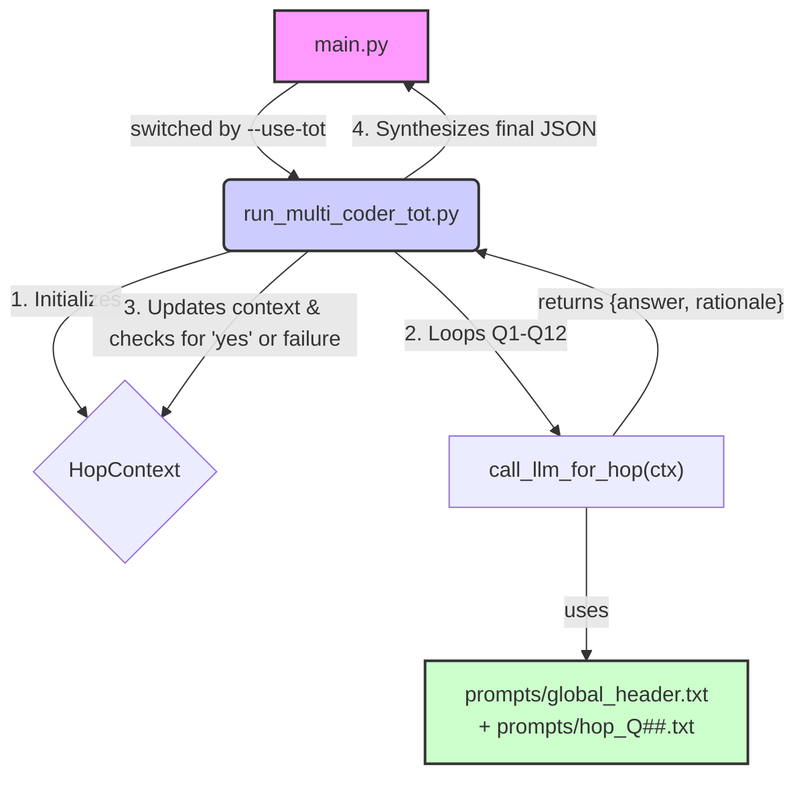

# ToT Pipeline Architecture

The claim framing analysis can be run using a 12-hop Tree of Thoughts (ToT) model. This ensures each classification decision is transparent, auditable, and strictly follows the predefined rule-based decision tree.

## Data Flow

The process is managed by `run_multi_coder_tot.py` and follows this sequence for each text segment:

1.  **Initialization**: A `HopContext` object is created to hold the state for the segment.
2.  **Hop Loop (Q1-Q12)**: The controller iterates through the 12 questions.
3.  **Prompt Assembly**: For each hop, a unique prompt is built by combining the `global_header.txt` with the hop-specific `hop_Q##.txt` file.
4.  **LLM Call**: The assembled prompt is sent to a deterministic LLM (`temperature=0`).
5.  **State Update**: The LLM's JSON response (`{"answer": "yes|no", "rationale": "..."}`) is parsed, and the `HopContext` is updated. The decision is logged to a trace file.
6.  **Early Exit**: If the LLM returns `"yes"`, the final frame is determined, and the loop terminates.
7.  **Finalization**: If the loop completes without a "yes," the frame defaults to `Neutral`. The final JSON output is then synthesized.

## Key Components

### HopContext
- **Purpose**: State management for a single text segment through the 12-hop chain
- **Location**: `hop_context.py`
- **Key Properties**:
  - `statement_id`, `segment_text`: Static segment data
  - `q_idx`, `is_concluded`, `final_frame`: Dynamic state
  - `analysis_history`, `reasoning_trace`: Audit trails

### Prompt System
- **Location**: `prompts/` directory
- **Structure**: Global header + hop-specific prompts
- **Content**: Each hop has few-shot examples, regex hints, and specific question text

### Tracing System
- **Purpose**: Audit trail for each hop decision
- **Location**: `utils/tracing.py`
- **Output**: JSON-Lines files per statement in `traces_tot/` directory

## Integration Points

The ToT pipeline integrates seamlessly with the existing codebase:

1. **Entry Point**: `main.py --use-tot` flag
2. **Output Schema**: Identical to standard pipeline (CSV with `Dim1_Frame`, etc.)
3. **Configuration**: Uses existing config.yaml structure
4. **Downstream**: Compatible with merge and stats modules

## Deterministic Behavior

The ToT pipeline ensures deterministic results through:
- Fixed question order (Q1-Q12)
- Deterministic LLM calls (`temperature=0`)
- Rule-based decision tree
- Comprehensive audit trails

## Error Handling

- **LLM Failures**: Retry logic with exponential backoff
- **JSON Parsing**: Graceful degradation to "uncertain"
- **Consecutive Uncertainty**: Automatic termination after 3 uncertain responses
- **Missing Prompts**: Clear error messages and graceful shutdown 